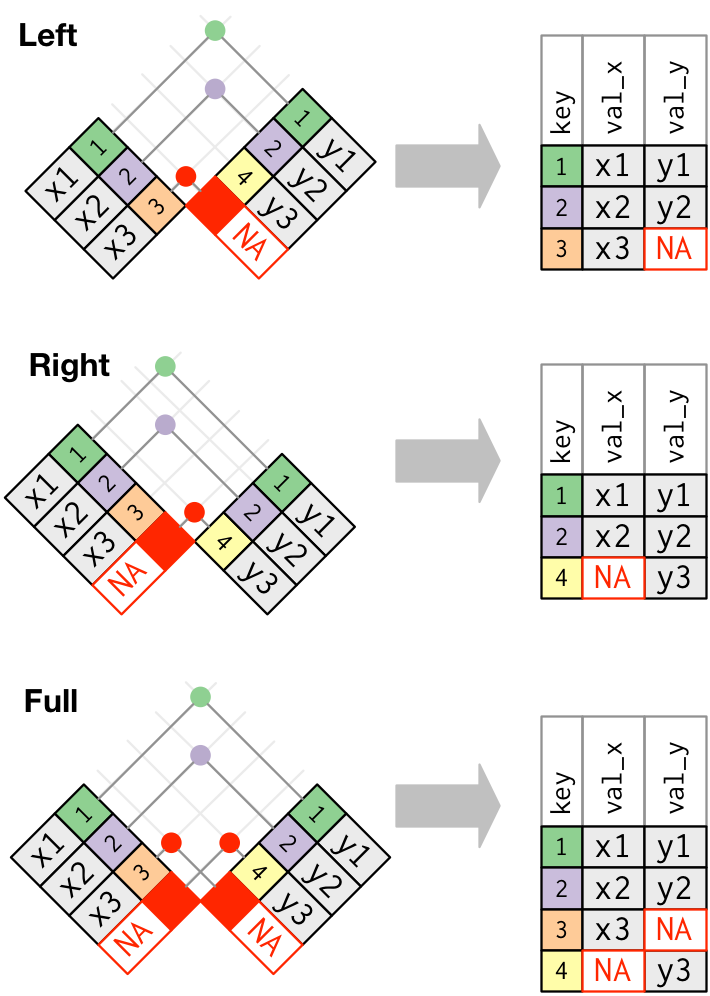
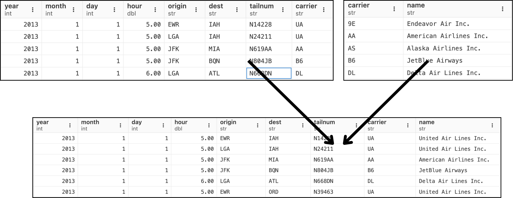
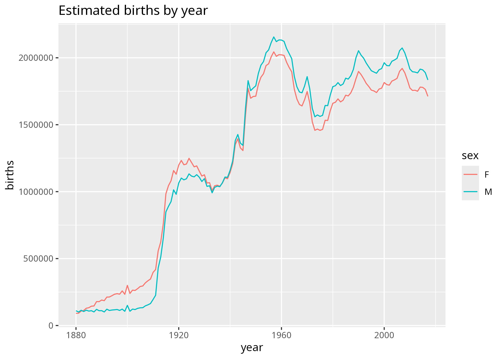



# Scan to Access The Slide
 

 <!--  -->

# What We'll Do Today {.smaller}
:::::: columns
::: {.column width="75%"}
Looking back: so far, we've learned several things ...  <br /><br />

Now, let's move on to learn:

1. **data manipulation**  $\rightarrow$ using tidyverse's <abbr title="(1) how to pronounce dplyr?  (2) mention at least 2 packages in tidyverse">dplyr</abbr>. Meet the 5 famous functions (verbs): `filter()`, `arrange()`, `select()`, `mutate()`, `summarise()`. 
2. **tables/datasets join** $\rightarrow$ basic SQL knowledge will be helpful. 
3. **spot issues when working with real datasets (e.g. outliers and missing values)**
:::

::: {.column width="5%"}
:::

::: {.column width="20%"}

:::
::::::

# Part I: Data manipulation/transformation with dplyr {.smaller}

dplyr gives concise verbs for common tasks:

-   `filter()` — pick rows
-   `arrange()` — reorder rows
-   `select()` — pick columns
-   `mutate()` — create/transform columns
-   `summarise()` — collapse to summaries $\rightarrow$ often must be preceded by `group_by()`


## Inspect mpg {.smaller}

We'll use the built-in `mpg` dataset for examples. <br />
Make sure you know some of useful [data inspection functions](https://github.com/erikaris/uos-gta/blob/main/intro-to-data-science/autumn-2025/data_inspection_cheatsheet.md). <br />
Read more about mpg dataset [here](https://rdrr.io/cran/gamair/man/mpg.html). 

```{webr}
#| warning: false
#| autorun: true
library(tidyverse)  # load library
```

```{webr}
#| warning: false
#| autorun: false
str(mpg)
```

## `filter()` - Select Observations/Rows {.smaller}

Select certain manufacturer, displ, and year?

```{webr}
#| warning: false
#| autorun: false
filter(mpg, manufacturer=="audi")
filter(mpg, displ > 2)
filter(mpg, displ > 2 & cyl > 6)  # how to turn it into a pipe-dplyr way?

# Multiple conditions
filter(mpg, manufacturer=="audi", year==1999)
filter(mpg, manufacturer=="audi" & year==1999)
filter(mpg, (manufacturer=="audi" | manufacturer=="chevrolet"), year==1999)
filter(mpg, (manufacturer %in% c("audi","chevrolet")), year==1999)

# pipe it to count()
filter(mpg, (manufacturer %in% c("audi","chevrolet")), year==1999) %>%
   count(manufacturer)

# filtering for sampling
sample_frac(mpg, 0.05, replace=TRUE) # sample 5% of the data
sample_n(mpg, 10, replace=TRUE) # sample of 10 rows
```

<!-- ## Your turn: Filter multiple condition {.smaller}

::: your-turn
Can you filter rows where the manufacturer is Audi OR the year of production (year) is 1999? Can you filter rows where the year of production (year) is 1999 and the manufacturer is NOT Audi?
:::

::: exercise-folder
```{webr}
#| exercise: hist-y1-y2
filter(mpg, ___)
```
:::

 -->

## `arrange()` — Reorder/Sort Rows {.smaller}
What is the base R counterpart for `arrange()`?

```{webr}
#| warning: false
#| autorun: false
rio2016Medals <- read_csv("data/Rio2016.csv")
arrange(rio2016Medals, Country)
arrange(rio2016Medals, desc(Country))
arrange(rio2016Medals, desc(Gold), desc(Silver), desc(Bronze))
```

<!-- ## Your turn: Result piping {.smaller}

::: your-turn
to better view the ordered tibble, pipe the results of the arrange function into the function View. Make sure that ties between countries with the same number of gold and silver medals are sorted based on the number of bronze medals.
:::

::: exercise-folder
```{webr}
#| exercise: dplyr-pipe-medals
rio2016Medals
```
:::

 -->

## select() — Selecting Columns {.smaller}

```{webr}
#| warning: false
#| autorun: false
select(mpg, manufacturer, hwy)
select(mpg, starts_with("d")) # Selecting with pattern

# Combine select + filter + arrange with pipes
mpg %>% 
  select(manufacturer, hwy) %>% 
  filter(manufacturer != "chevrolet" & hwy >=20) %>%
  arrange(desc(manufacturer))
```

## mutate() — Create New Variables {.smaller}

::: {.callout-note}
The mutate function doesn’t change the original data, meaning the new column is only available to functions that are piped after the mutate. 
:::

```{webr}
#| warning: false
#| autorun: false
mutate(rio2016Medals, Total = Gold + Silver + Bronze)
```

## summarise() - Create Summary {.smaller}

```{webr}
#| warning: false
#| autorun: false
summarise(mpg, avg = mean(hwy))

# grouped-based summary
mpg |> 
   group_by(year, manufacturer) |> 
   summarise(count = n())
```

<!-- ## summarise() and group_by() {.smaller}

```{webr}
#| warning: false
#| autorun: true

``` -->

<!-- ## Your turn: Combine mutate and summarise {.smaller}

::: your-turn
Look at the second page of cheatsheet for useful functions to use with mutate and summarise. How many unique models do each manufacturer produce? Create a new column with a ratio of highway efficiency (hwy) vs city efficiency (cty) called HwyCtyRatio.
:::

::: exercise-folder
```{webr}
#| exercise: dplyr-summarise-hwyctyration
mpg
```
:::

 -->

# Part II: Combining datasets

## Basic Idea {.smaller}
Recommended reading material: [http://r4ds.had.co.nz/relational-data.html](http://r4ds.had.co.nz/relational-data.html)

::: {layout-ncol=2}
{width=60%}


:::

## An Illustration {.smaller}
:::::: columns
::: {.column width="50%"}
We have `flights2` and `airlines` table. 

We want to have the full name of the airline in the `flights2` table rather than the carrier abbreviation. <br />
How to achieve this?


:::

::: {.column width="50%"}
```{webr}
#| warning: false
#| autorun: false
library(nycflights13)

flights2 <- flights %>% 
  select(year:day, hour, origin, dest, tailnum, carrier)

flights2 %>% 
  left_join(airlines, by = "carrier")
```
:::
::::::


# Part III: Spot Issues in Real Datasets

## Working with real data — Free School Meals (FSM) {.smaller}

```{webr}
#| warning: false
#| autorun: false
meals <- read_csv("data/freeschoolmeals.csv")
head(meals)

# check summary
summary(meals$FSMTaken)
# significant difference between median & mean --> mean affected by outliers --> potential problem.
# 17 NAs

mean(meals$FSMTaken)  # NA
mean(meals$FSMTaken, na.rm=TRUE) # NA removed, but mean is still suspiciously high.
```

## FSM - Filter out 9999 and handle NA {.smaller}

```{webr}
#| warning: false
#| autorun: false
meals |>
   filter(FSMTaken != 999) |>
   mean(na.rm = TRUE)
```
<br /> Or keep NA and exclude 9999:

```{webr}
#| warning: false
#| autorun: false
filter(meals, (FSMTaken < 9999 | is.na(FSMTaken))) %>% count()
filter(meals, (FSMTaken < 9999 | is.na(FSMTaken))) %>% 
  mutate(newFSMTaken = ifelse(is.na(FSMTaken), floor(mean(FSMTaken, na.rm = TRUE)), FSMTaken))
```

<br /> Missing values — simple imputation example.

```{webr}
#| warning: false
#| autorun: false
y <- c(4,5,6,NA)
is.na(y)
y[is.na(y)] <- mean(y, na.rm = TRUE)
y
```

# Further resources {.smaller}

-   Check the list of resources on the last page of the worksheet (pdf)
-   <span style="color:red">Erika's pick: </span>[Posit Cheatsheet](https://posit.co/resources/cheatsheets/)

# Bonus Challenge (For Anyone Who Dare to Try) {.smaller}

## Combining dplyr and ggplot {.smaller}
:::::: columns
::: {.column width="50%"}
`babynames` dataset:

```{webr}
#| warning: false
#| echo: false
#| autorun: true
install.packages('babynames')
library(babynames)
head(babynames)
```
:::
::: {.column width="50%"}
The output that we want:


:::
::::::

Go to next slide to try out. 

## Combining dplyr and ggplot {.smaller}
```{webr} 
#| exercise: dplyr-ggplot
install.packages('babynames')
library(babynames)
library(tidyverse)

babynames %>% 
  group_by(___, ___) %>% 
  summarise(___ = ___) %>% 
  ungroup %>% 
  ggplot(___) +
  geom___() +
  labs(title = ___)
  ___
```

<!-- ```{webr} 
#| exercise: dplyr-ggplot
install.packages('babynames')
library(babynames)
library(tidyverse)

babynames %>% 
  group_by(year, sex) %>% 
  summarise(births = sum(n)) %>% 
  ungroup %>%    # ungroup equals to .groups = "drop"
  ggplot(aes(x = year, y = births, color = sex)) +
  geom_line() +
  labs(title = "Estimated births by year")
``` -->

# That’s a wrap! {.smaller}
Now it’s your turn to dive into the worksheet
<br/><br/>
 <!--  -->
